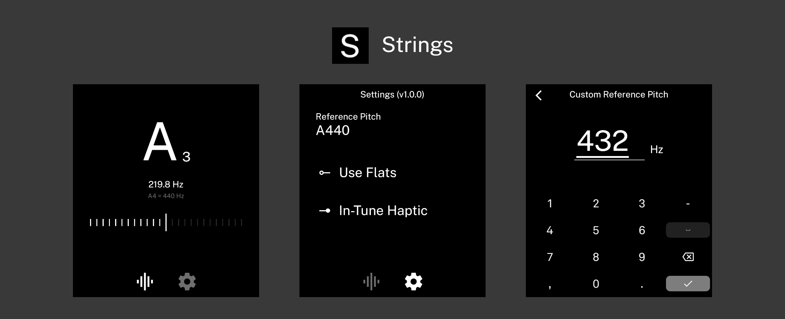

A minimal tuner app for the Light Phone 3.

## Features

- Chromatic tuner
- Adjustable reference pitch
- Adjustable note display (sharp/flat)

## Planned features

- Tuning drone
- Instrument presets
- Noise sensitivity adjustment
- Transposition

## Known issues

Octave detection can occasionally be off by +-1 octave, but this does not affect tuning accuracy.

## Installation

The latest APK is available in [releases](https://github.com/garado/metronome/releases/).

I recommend using [Obtainium](https://github.com/ImranR98/Obtainium) and adding the repository's URL to receive updates.

## Acknowledgements

Thanks [Vandam](https://github.com/vandamd) for creating [light-template](https://github.com/vandamd/light-template), which made this app possible. If you enjoy this app, [consider sponsoring him](https://github.com/sponsors/vandamd)!
